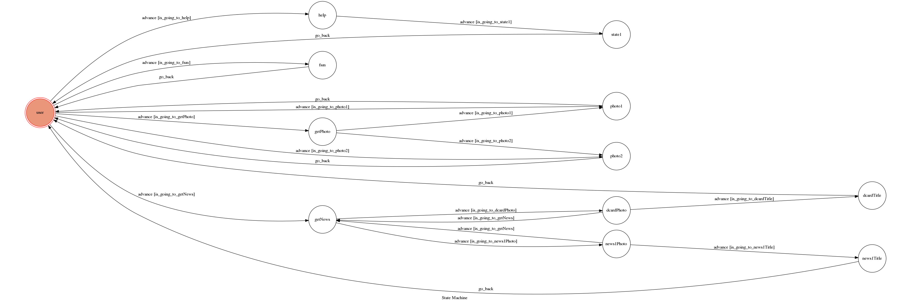

# TOC Project 2019

A Facebook messenger bot based on a finite state machine

## Finite State Machine


## Usage
The initial state is set to `user`.

Every time `user` state is triggered to `advance` to another state, it will `go_back` to `user` state after the bot replies corresponding message.

* user
	* 查看使用方式:
	    input "help"
		* Reply:
		    輸入 "news" 查看新聞
            輸入 "FSM" 查看FSM圖
            輸入 "照片" 查看隨機照片
            

	* 查看新聞:
        input "news"
		* Reply:
            
            * press "Dcard"
            	
            * or press "民報"
            	
    * 查看FSM圖:
            input "fsm" or "FSM"
        * Reply:
            
    * 查看隨機照片:
            input 照片
        * Reply:
            * press "羽生結弦"
            	
            * press "新垣结衣"
            	


## Setup

### Prerequisite
* Python 3
* Facebook Page and App
* HTTPS Server

#### Install Dependency
```sh
pip3 install -r requirements.txt
```

* pygraphviz (For visualizing Finite State Machine)
    * [Setup pygraphviz on Ubuntu](http://www.jianshu.com/p/a3da7ecc5303)

#### Secret Data

`VERIFY_TOKEN` and `ACCESS_TOKEN` **MUST** be set to proper values.
Otherwise, you might not be able to run your code.

#### Run Locally
You can either setup https server or using `ngrok` as a proxy.

**`ngrok` would be used in the following instruction**

```sh
./ngrok http 5000
```

After that, `ngrok` would generate a https URL.

#### Run the sever

```sh
python3 app.py
```


## Reference
[TOC-Project-2019](https://github.com/winonecheng/TOC-Project-2019) from [winonecheng](https://github.com/winonecheng)
[TOC-Project-2017](https://github.com/Lee-W/TOC-Project-2017) from [@Lee-W](https://github.com/Lee-W)
